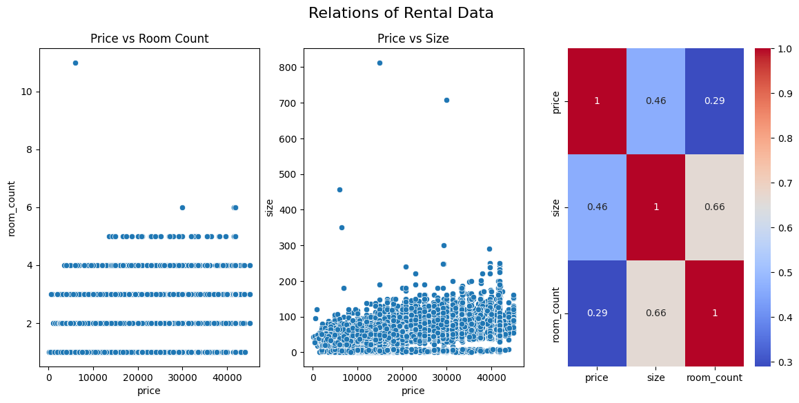
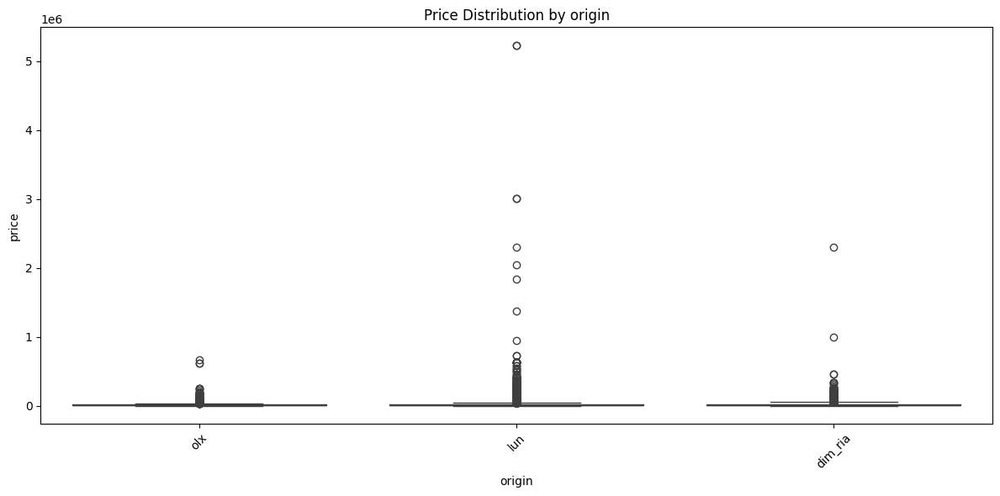
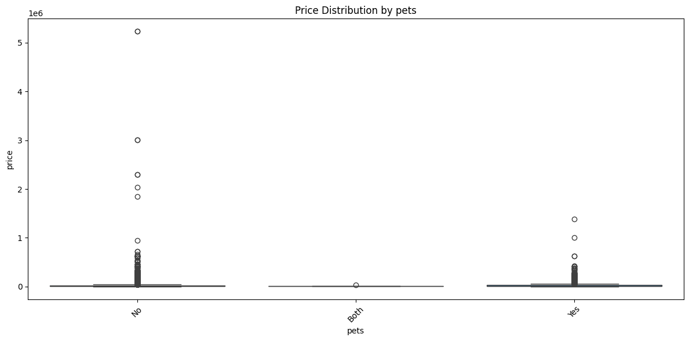

# Ukraine Rent Prices Data Analyst Project

## Welcome to My Apartment Hunt Data Adventure!

Okay, so I've been thinking a lot about renting an apartment lately. You know, the usual: "Is this a good deal?", "Am I overpaying?", "Where can I find something decent that won't break the bank?". It hit me that instead of just endlessly scrolling through listings, I could actually use my data skills to answer these questions systematically. So, this project isn't just a technical exercise; it's my personal quest to understand the Ukrainian rental market better and, hopefully, find that perfect place (or at least help others do the same!).

This project aims to perform a full data analysis cycle on apartment rental prices across Ukraine. We'll be scraping data from the most popular real estate platforms, cleaning it up, storing it, analyzing it, and finally visualizing it to uncover key insights.

## Short Overview of the results

Bigger rentals generally cost more. In the scatter plot for Price vs Size, there is an upward spread, indicating the moderate trend. Size however doesn't contribute to the price as much. 

Listings from dim_ria have the highest average and median prices, lun listings follow with intermediate prices, and olx listings show the lowest average and median prices.

Rentals that allow pets have the highest average and median prices, followed by rentals that do not allow pets.

## Project Goals
- Gain a comprehensive understanding of current rental prices across different regions and cities in Ukraine.
- Identify trends and patterns in rental prices (e.g., how do prices vary by number of rooms, location, amenities,year?).
- Compare prices across different platforms to see if there are significant discrepancies.
- Develop a robust data pipeline from web scraping to interactive visualization.
- Ultimately, make more informed decisions about renting an apartment in Ukraine (for myself and anyone else who finds this useful!).

## Listing websites
- OLX https://www.olx.ua/uk/nedvizhimost/kvartiry/dolgosrochnaya-arenda-kvartir/?currency=UAH
- Dom.ria https://dom.ria.com/uk/arenda-kvartir/kiev/
- Lun.ua https://lun.ua/rent/kyiv/flats

## Technologies Used
- Python: The powerhouse for web scraping, data cleaning, and initial analysis.
- SQL (PostgreSQL): For storing the scraped data in a structured and queryable format.
- Power BI: To create interactive dashboards and visualizations that bring our data to life and make it easy to explore trends and insights.

## What I Hope to Discover
- Average rent prices per square meter in Kyiv, Lviv, Odesa, and other major cities.
- How does the number of rooms impact the price?
- Are there specific districts or neighborhoods that offer better value?
- What's the typical price range for a 1-bedroom apartment in a decent area?
- Can we predict rental prices based on various features?

## Files
`explore.ipynb`: Python scripts for cleaning and initial data analysis.
`explore.sql`: SQL scripts for creating views for further Tableau visuals.
`RentalReportUkraine.pbix`: PowerBI reports with visuals.
`README.md`: a readme file.
`images`: folder with images for README.md.
This files are to big to be on github, you can find them on my [google drive]
(https://drive.google.com/drive/folders/1qT2l6mCh3A59pGCO-LKB9kHq0-suFRFV?usp=sharing):
`insert_data.sql` - SQL scripts for creating the database schema and inserting all the values
`olx_no_pets.csv`: data about Olx rental listings, that do not allow pets.
`olx_yes_pets.csv`: data about Olx rental listings, that do allow pets.
`dim_ria.csv`: data about dim.ria rental listings.
`lun.csv`: data about lun rental listings.
`sql_ready.csv`: Prepared and cleaned, final version of rental data across all chosen rental websites.